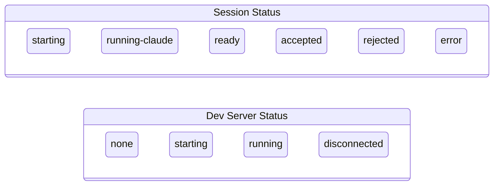
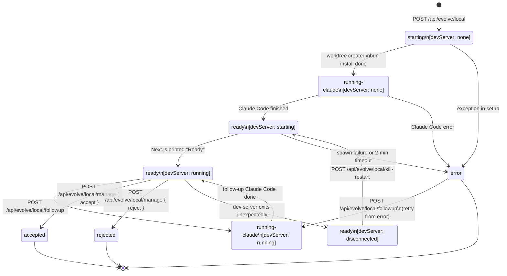

# PRIMORDIA.md

> **This file is the living brain of Primordia.**
> Every time Claude Code runs — whether triggered by the evolve pipeline or manually — it should:
> 1. **Read this file first** to understand the current state of the app.
> 2. **Update this file last** — keep it up to date and accurate.
>
> This file is the source of truth for architecture and features.

---

## What Is Primordia?

Primordia is a self-modifying web application. Users interact with an AI chat interface. To propose a change to the app, they click the Edit (pencil) icon button in the header to navigate to the `/evolve` page — a dedicated "submit a request" form. Requests are automatically built as local git worktree previews, powered by the Claude Agent SDK. Users then accept or reject each preview.

The core idea: **the app becomes whatever its users need it to be**, with no coding or git knowledge required from users.

---

## Current Architecture

### Tech Stack
| Layer | Technology | Why |
|---|---|---|
| Frontend framework | Next.js 15 (App Router) | AI models write Next.js well |
| Styling | Tailwind CSS | AI models write Tailwind well; no CSS files to manage |
| Language | TypeScript | Catches mistakes; Claude Code understands it well |
| AI API | Anthropic SDK (`@anthropic-ai/sdk`) | Streaming chat via `claude-sonnet-4-6` |
| Hosting | exe.dev | Remote dev servers via `bun run dev`; no build step required |
| AI code gen | `@anthropic-ai/claude-agent-sdk` | `query()` runs Claude Code in git worktrees for evolve requests |
| Database | bun:sqlite | Local SQLite for passkey auth **and evolve session persistence**; same adapter on exe.dev and local dev |

### File Map

```
primordia/
├── PRIMORDIA.md                   ← You are here. Read me first, update me last.
├── .env.example                   ← Copy to .env.local, fill in secrets
├── .gitignore
├── next.config.ts                 ← Minimal Next.js config
├── tailwind.config.ts
├── postcss.config.mjs
├── tsconfig.json
├── package.json
│
├── changelog/                     ← One .md file per change: YYYY-MM-DD-HH-MM-SS Description.md
│   └── *.md                       ← Filename = short description; body = full what+why detail
│
├── scripts/
│   ├── generate-changelog.mjs    ← Prebuild: reads changelog/*.md → public/changelog.json + lib/generated/system-prompt.ts
│   └── deploy-to-exe-dev.sh      ← `bun run deploy-to-exe.dev <server>`: SSH deploy to <server>.exe.xyz
│
├── public/
│   └── changelog.json            ← Build artifact (gitignored); generated by scripts/generate-changelog.mjs
│
├── lib/
│   ├── generated/
│   │   └── system-prompt.ts      ← Build artifact (gitignored); static chat system prompt with PRIMORDIA.md + last 30 changelog filenames baked in
│   ├── auth.ts                    ← Session helpers: createSession, getSessionUser
│   ├── local-evolve-sessions.ts  ← Shared session state + business logic for local evolve; persists to SQLite
│   └── db/
│       ├── index.ts               ← Factory: getDb() → SQLite (always)
│       ├── types.ts               ← Shared DB types: User, Passkey, Challenge, Session, CrossDeviceToken, EvolveSession
│       └── sqlite.ts              ← bun:sqlite adapter (includes evolve_sessions table)
│
├── app/                           ← Next.js App Router
│   ├── layout.tsx                 ← Root layout (font, metadata, body styling)
│   ├── page.tsx                   ← Entry point — renders <ChatInterface>
│   ├── globals.css                ← Tailwind base imports only
│   ├── branches/
│   │   └── page.tsx               ← Server component: git branch tree with diagnostics (dev only)
│   ├── changelog/
│   │   └── page.tsx               ← Server component: renders auto-generated changelog
│   ├── evolve/
│   │   ├── page.tsx               ← Dedicated "propose a change" page; renders <EvolveForm>
│   │   └── session/
│   │       └── [id]/
│   │           └── page.tsx       ← Session-tracking page; reads from SQLite, renders <EvolveSessionView>
│   ├── login/
│   │   ├── page.tsx               ← Passkey login/register page + QR cross-device tab
│   │   └── approve/
│   │       └── page.tsx           ← Approval page: authenticated device approves a QR sign-in
│   └── api/
│       ├── chat/
│       │   └── route.ts           ← Streams Claude responses via SSE
│       ├── check-keys/
│       │   └── route.ts           ← Returns list of missing required env vars (called on page load)
│       ├── git-sync/
│       │   └── route.ts           ← POST pull + push the current branch (used by GitSyncDialog)
│       ├── auth/
│       │   ├── session/
│       │   │   └── route.ts       ← GET current session user
│       │   ├── logout/
│       │   │   └── route.ts       ← POST clear session
│       │   ├── passkey/
│       │   │   ├── register/
│       │   │   │   ├── start/route.ts  ← Generate WebAuthn registration options
│       │   │   │   └── finish/route.ts ← Verify registration, create user+session
│       │   │   └── login/
│       │   │       ├── start/route.ts  ← Generate WebAuthn authentication options
│       │   │       └── finish/route.ts ← Verify authentication, create session
│       │   └── cross-device/
│       │       ├── start/route.ts      ← POST create a cross-device token; returns tokenId
│       │       ├── poll/route.ts       ← GET poll token status; sets session cookie on approval
│       │       ├── approve/route.ts    ← POST approve a token (requires auth on approver device)
│       │       └── qr/route.ts         ← GET SVG QR code encoding the approval URL for a tokenId
│       └── evolve/
│           └── local/
│               ├── route.ts       ← POST start session, GET status
│               ├── manage/
│               │   └── route.ts   ← POST accept/reject a local session
│               ├── followup/
│               │   └── route.ts   ← POST submit a follow-up request on an existing ready session
│               └── restart/
│                   └── route.ts   ← POST bun install + restart dev server (called after accept)
│
├── components/
│   ├── AcceptRejectBar.tsx        ← Accept/reject bar for local preview worktrees
│   ├── ChatInterface.tsx          ← Main chat UI (chat only); Edit icon button links to /evolve
│   ├── EvolveForm.tsx             ← "Submit a request" form; POSTs then redirects to /evolve/session/{id}
│   ├── EvolveSessionView.tsx      ← Client component for session tracking page; polls for live progress
│   ├── GitSyncDialog.tsx          ← Modal: git pull + push via /api/git-sync
│   └── NavHeader.tsx              ← Shared nav header (title, branch name, nav links)
```

### Data Flow

#### Normal Chat
```
User types message
  → POST /api/chat
  → Anthropic API (claude-sonnet-4-6, streaming)
  → SSE stream back to browser
  → Message appended to chat
```

#### Evolve Request (local dev and exe.dev — NODE_ENV=development)
```
User types change request on /evolve page
  → POST /api/evolve/local
      → generates slug via Claude Haiku; finds unique branch name
      → creates LocalSession in memory (id, branch, worktreePath, request, createdAt, …)
      → persists EvolveSession record to SQLite (evolve_sessions table)
      → returns { sessionId }
  → browser redirects to /evolve/session/{sessionId}
  → server component reads initial state from SQLite, renders EvolveSessionView
  → git worktree add ../primordia-worktrees/{slug} -b {slug}
  → bun install in worktree
  → copy .primordia-auth.db + symlink .env.local into worktree
  → @anthropic-ai/claude-agent-sdk query() in worktree
      → streams SDKMessage events → formatted progressText appended in memory
      → progressText flushed to SQLite (throttled, ≤1 write/2s per session)
  → spawn: bun run dev in worktree; Next.js picks its own port
  → EvolveSessionView polls /api/evolve/local?sessionId=... every 5s
      → GET returns from in-memory map (active) or SQLite (completed/restarted)
  → Preview link shown when status becomes "ready"
  → User clicks Accept → POST /api/evolve/local/manage { action: "accept" }
      → git merge {branch} --no-ff
      → kill dev server, git worktree remove, git branch -D
  → User clicks Reject → POST /api/evolve/local/manage { action: "reject" }
      → kill dev server, git worktree remove, git branch -D
```

#### Evolve Session State Machine

Each evolve session tracks two independent dimensions persisted to SQLite:

- **`LocalSessionStatus`** — the session pipeline lifecycle (what Claude / the worktree is doing)
- **`DevServerStatus`** — the state of the preview dev server for this session



Since the two dimensions are independent, here are the valid combined states and how the system moves through them:



**Session status reference**

| `LocalSessionStatus` | Meaning |
|---|---|
| `starting` | Session created; git worktree + `bun install` in progress |
| `running-claude` | Claude Agent SDK `query()` is streaming tool calls into the worktree |
| `ready` | Claude Code finished; worktree is live and interactive |
| `accepted` | User clicked Accept; branch merged into parent, worktree deleted |
| `rejected` | User clicked Reject; worktree and branch discarded without merging |
| `error` | An exception was thrown during `starting` or `running-claude` |

**Dev server status reference**

| `DevServerStatus` | Meaning |
|---|---|
| `none` | Dev server not yet started (session is `starting` or `running-claude`) |
| `starting` | `bun run dev` has been spawned; waiting for Next.js "Ready" signal |
| `running` | Dev server is up; `previewUrl` is set and the preview is accessible |
| `disconnected` | Server was running, then exited unexpectedly (branch still exists) |

**Key transition triggers**

| Transition | Triggered by |
|---|---|
| `[new]` → `starting` | `POST /api/evolve/local` |
| `starting` → `running-claude` | `startLocalEvolve()` after worktree setup |
| `running-claude` → `ready` + devServer `none→starting` | `startLocalEvolve()` after `query()` completes |
| devServer `starting` → `running` | Next.js "Ready" string detected in dev server output |
| `ready` → `running-claude` (devServer stays `running`) | `POST /api/evolve/local/followup` |
| `running-claude` → `ready` (devServer stays `running`) | `runFollowupInWorktree()` on success |
| `ready` → `accepted` / `rejected` | `POST /api/evolve/local/manage` |
| devServer `running` → `disconnected` | Dev server `close` event + branch still present (3 s later) |
| devServer `disconnected` → `starting` | `POST /api/evolve/local/kill-restart` |
| any → `error` | Uncaught exception inside the respective async helper |

---

#### Deploy to exe.dev (one-command remote dev server)
```
bun run deploy-to-exe.dev <server-name>
  → scp .env.local → <server-name>.exe.xyz
  → ssh: install git + bun if missing
  → ssh: git clone / git pull origin main
  → ssh: bun install
  → ssh: nohup HOSTNAME=0.0.0.0 bun run dev  (NODE_ENV=development)
  → wait for "Ready" signal, tail logs
  → app is reachable at http://<server-name>.exe.xyz:3000
     (uses the same local evolve flow — no GitHub/Vercel required)
```

---

## Environment Variables

These must be set in:
- **Local development**: `.env.local` (copy from `.env.example`)
- **exe.dev**: `.env.local` is copied automatically by `scripts/deploy-to-exe-dev.sh`

| Variable | Required | Description |
|---|---|---|
| `ANTHROPIC_API_KEY` | Yes | Powers the chat interface and Claude Code in the evolve pipeline |
| `GITHUB_TOKEN` | No | Personal access token (repo scope) — enables authenticated git pull/push in GitSyncDialog; falls back to `origin` remote if unset |
| `GITHUB_REPO` | No | `owner/repo` slug (e.g. `primordia-org/primordia`) — used alongside `GITHUB_TOKEN` to build the authenticated remote URL |

---

## Setup Checklist (One-Time)

1. **Clone** this repo.
2. **Copy** `.env.example` to `.env.local` and fill in `ANTHROPIC_API_KEY`.
3. **Run** `bun install && bun run dev`.
4. The app is live at `http://localhost:3000`.

To deploy to exe.dev: `bun run deploy-to-exe.dev <server-name>`

---

## Design Principles for Claude Code

When implementing changes, follow these principles:

1. **Read PRIMORDIA.md first.** Understand the current architecture before making changes.
2. **Minimal changes.** Only modify what is necessary for the user's request.
3. **No clever magic.** Write code that is easy for another AI to read and modify later.
4. **Minimal dependencies.** Every new dependency is a future maintenance burden. Avoid them unless essential.
5. **TypeScript everywhere.** Explicit types make the codebase more navigable for AI models.
6. **Tailwind for styling.** Do not add CSS files or CSS-in-JS libraries.
7. **App Router conventions.** Follow Next.js App Router patterns: `page.tsx`, `layout.tsx`, `route.ts`.
8. **Add exactly one changelog file per pull request.** After every set of changes, create a single new file in `changelog/` named `YYYY-MM-DD-HH-MM-SS Description of change.md` (UTC time, e.g. `2026-03-16-21-00-00 Fix login bug.md`). The filename is the short description; the file body is the full "what changed + why" detail in markdown. One PR = one changelog entry, even if the PR went through multiple iterations.

---

## Current Features

| Feature | Status | Notes |
|---|---|---|
| Chat interface (streaming) | ✅ Live | Streams from `claude-sonnet-4-6` via SSE |
| Evolve mode | ✅ Live | Dedicated `/evolve` page; Edit icon in chat header |
| Local evolve pipeline | ✅ Live | git worktree → Claude Agent SDK → local preview → accept/reject |
| Evolve follow-up requests | ✅ Live | Chain multiple Claude passes on the same branch; form appears when session is ready |
| exe.dev deploy | ✅ Live | One-command SSH deploy; identical to local dev flow |
| Dark theme | ✅ Live | Default dark UI with Tailwind |
| Passkey authentication | ✅ Live | WebAuthn passkeys via /login; sessions stored in SQLite |
| Cross-device QR sign-in | ✅ Live | Laptop shows QR code; authenticated phone scans it and approves; laptop gets a session |

---

## Stretch Goals (Not Implemented)

These were noted at project inception but are explicitly out of scope for the MVP:

- **Fork flow**: one-click fork to user's own instance
- **Voting**: upvote proposed evolve requests before they get built
- **Rollback**: "go back to before X was added" via natural language
- **Multi-tenant**: each user gets their own Primordia instance

## Changelog

> **Changelog entries are stored exclusively in `changelog/`** — never in this file.
> Each file is named `YYYY-MM-DD-HH-MM-SS Description.md`; the filename is the short description and the body has the full what+why detail.
> **One PR = one changelog entry.** Do not create multiple changelog files for a single pull request — consolidate all changes into one entry.
> The auto-generated `/changelog` page and `lib/generated/system-prompt.ts` are both built from these files at build time via `scripts/generate-changelog.mjs`. Having each entry as a separate timestamped file prevents merge conflicts.
> Do **not** add changelog bullets here. The prebuild step reads `changelog.json` and bakes the last 30 filenames into the static chat system prompt automatically.
